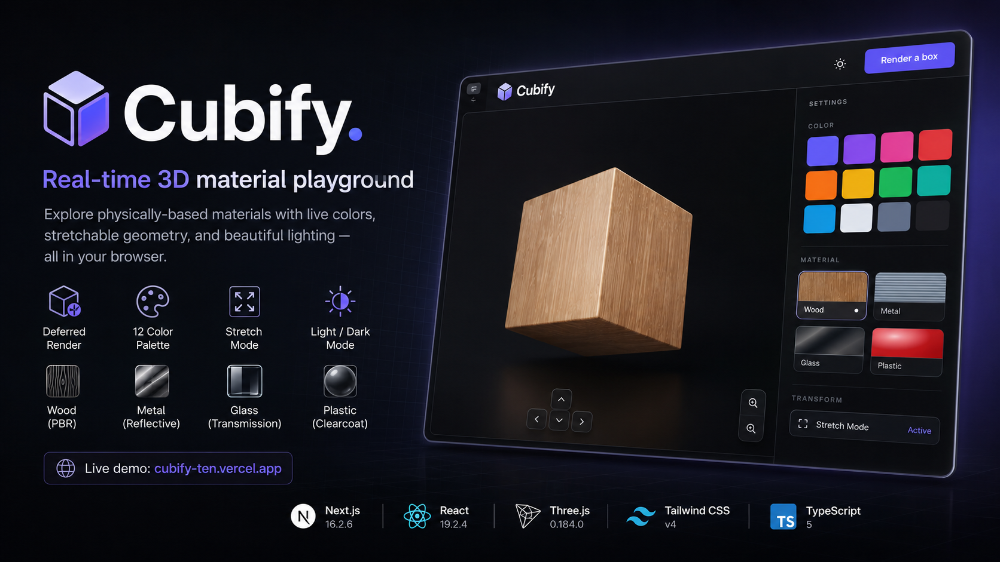

# Cubify



A real-time 3D material playground built with Next.js, Three.js, and Tailwind CSS. Cubify lets you explore physically-based rendering materials — wood, metal, glass, plastic — directly in the browser, with live color switching, freeform geometry stretching, and full light/dark mode support.

**Live demo:** [cubify-ten.vercel.app](https://cubify-ten.vercel.app)

---

## The Experience

### Deferred Render

The viewport starts empty. Clicking **Render a box** initialises the WebGL context on demand — Three.js (~500 KB) never loads until the user asks for it. This keeps the initial page fast and makes the interaction feel intentional.

### Material Presets

| Preset | What it looks like |
|--------|--------------------|
| **Wood** | Full PBR — diffuse, normal, roughness, and ambient occlusion maps. Grain and surface variation are physically grounded. |
| **Metal** | Fully metallic surface (`metalness: 1`) with low roughness and a boosted environment map intensity for sharp reflections. |
| **Glass** | `MeshPhysicalMaterial` with `transmission: 0.92` and `ior: 1.52` — physically accurate light refraction rather than alpha transparency. |
| **Plastic** | Clearcoat layer on top of a coloured base. The two-layer model gives it the characteristic lacquered sheen. |

### Color Palette

Twelve curated swatches that apply to the custom (non-preset) shading mode. Selecting a swatch while a preset is active switches immediately — no need to deselect the preset first.

### Stretch Mode

Enable Stretch Mode to reveal eight sphere handles at the corners of the box. Drag any handle to reshape the geometry symmetrically — the opposite corner mirrors every move so the box always stays centred at the origin. The cursor changes to `grab` on hover and back to `default` on release.

### Camera Controls

- **Mouse drag** — orbit around the model via OrbitControls with damping
- **Arrow keys / D-pad** — frame-rate-driven smooth orbit; holding a key accelerates naturally
- **Scroll wheel / zoom buttons** — dolly in and out with exponential scaling (3% per frame)
- Polar angle limits prevent the camera from flipping at the poles

### Light / Dark Mode

The toggle switches the Three.js scene background and the entire UI simultaneously. No flash on first load — the `dark` class is applied server-side in `layout.tsx` and React hydration keeps it in sync from there.

### Texture Loading UX

Switching to Wood shows a blurred overlay with a spinner until all four texture maps finish downloading. The overlay disappears the moment the last map resolves — not when the first one does.

### Responsive Layout

On mobile the settings panel sits below the viewport as a full-width strip. On `md+` it becomes a fixed-width sidebar. The 3D canvas fills all remaining space in both layouts.

---

## Engineering

### Stack

| Layer | Version |
|-------|---------|
| Next.js (App Router) | 16.2.6 |
| React | 19.2.4 |
| Three.js | 0.184.0 |
| Tailwind CSS | v4 |
| TypeScript | 5 |

---

### Three.js Stays Out of the Initial Bundle

```ts
const Playground = dynamic(() => import("@/components/Playground"), {
  ssr: false,
  loading: () => <div className="w-full h-full bg-[#f2f2f2] dark:bg-[#0f0f0f]" />,
});
```

`next/dynamic` with `ssr: false` splits Three.js into its own chunk that never appears in the initial parse. This directly reduces Total Blocking Time. The loading fallback is a colour-matched `div` so there is no layout shift while the chunk loads.

---

### Scene Lifecycle Isolated to One Effect

The entire WebGL scene — renderer, camera, lights, geometry, controls, event listeners — lives inside a single `useEffect` that runs once when the user clicks Render. The cleanup function tears everything down completely:

```ts
return () => {
  cancelAnimationFrame(animId);
  globalThis.removeEventListener("resize",  onResize);
  globalThis.removeEventListener("keydown", onKeyDown);
  controls.dispose();
  disposeMaterial(box.material);
  geometry.dispose();
  handles.forEach(h => h.material.dispose());
  renderer.dispose();
  renderer.domElement.remove();
};
```

No WebGL context leaks. No dangling event listeners. Hot-reload works cleanly in development.

---

### Ref-Function Bridge for Cross-Boundary Updates

React props update the Three.js scene without rebuilding it. Instead of re-running the scene-setup effect on every prop change (which would destroy and recreate the entire renderer), each reactive concern writes a function into a ref during setup:

```ts
// Refs declared in the component
const setSceneBgFn  = useRef<((dark: boolean) => void) | null>(null);
const showHandlesFn = useRef<(() => void) | null>(null);
const hideHandlesFn = useRef<(() => void) | null>(null);

// Populated inside the scene setup effect
setSceneBgFn.current = (dark) => { bgColor.set(dark ? "#0f0f0f" : "#f2f2f2"); };
showHandlesFn.current = () => handles.forEach(h => { h.visible = true; });
```

Separate `useEffect` hooks for `isDark` and `isStretching` call through those refs. The scene never restarts — only the specific mutation runs.

---

### Material Factory and Live GPU Memory Management

`buildMaterial` is a pure factory. The material-swap effect disposes the old material (including all GPU texture buffers) before building a new one:

```ts
useEffect(() => {
  if (meshRef.current) {
    disposeMaterial(meshRef.current.material);
    meshRef.current.material = buildMaterial(preset, color, onLoad);
  }
}, [preset, color]);
```

`disposeMaterial` walks every texture slot explicitly to prevent VRAM accumulation across switches:

```ts
s.map?.dispose();
s.normalMap?.dispose();
s.roughnessMap?.dispose();
s.aoMap?.dispose();
m.dispose();
```

---

### PBR Wood Texture Pipeline

Wood uses four maps with correct colour-space configuration:

```ts
diff.colorSpace = THREE.SRGBColorSpace; // perceptual — albedo only
// nor, rough, ao stay in linear space (data maps, not colour)
```

All four loads are tracked by a single `THREE.LoadingManager`. Its `onLoad` fires once after every map is resident — not after the first:

```ts
const manager = new THREE.LoadingManager(onAllLoaded);
const loader  = new THREE.TextureLoader(manager);
```

The spinner overlay is shown from the moment Wood is selected and dismissed exactly when the callback fires.

---

### Stretch Mode: Camera-Facing Drag Plane

Raycasting against the 8 corner handles gives a 3D hit point. To translate subsequent mouse movement into geometry changes, a `THREE.Plane` is built that faces the camera and passes through the dragged handle:

```ts
const normal = new THREE.Vector3()
  .subVectors(camera.position, controls.target)
  .normalize();
dragPlane.setFromNormalAndCoplanarPoint(normal, activeHandle.position);
```

Every `pointermove` projects the ray onto this plane. The hit point maps to new box dimensions via the corner's sign vector — which axis the drag affects is determined by the `±1` components of that corner's `CORNER_SIGNS` entry. Reshaping is always symmetric: both the dragged corner and its diagonally opposite corner move, keeping the centroid fixed at the origin.

OrbitControls is disabled for the duration of the drag and re-enabled on `pointerup`.

---

### Keyboard Camera via Spherical Coordinates

Arrow-key orbiting converts the camera position to `THREE.Spherical`, increments `theta` or `phi`, then converts back to Cartesian:

```ts
sph.setFromVector3(tmp.copy(camera.position).sub(controls.target));
if (keys.has("ArrowLeft"))  sph.theta -= ORBIT_SPEED;
if (keys.has("ArrowUp"))    sph.phi    = Math.max(MIN_PHI, sph.phi - ORBIT_SPEED);
camera.position.copy(controls.target).add(tmp.setFromSpherical(sph));
```

`sph` and `tmp` are allocated once outside the animation loop — no per-frame GC pressure. `MIN_PHI = 0.08` and `MAX_PHI = π − 0.08` prevent gimbal flip at the poles.

---

### SSR-Safe Dark Mode Without Flash

The `dark` class is set statically on `<html>` in `layout.tsx` (server-rendered), so the dark background is present from the very first paint with no client-side JavaScript needed. A `useEffect` handles subsequent toggles. Because the class strategy is used throughout, all Tailwind `dark:` utilities respond at exactly the same moment the class flips.

---

### Zero-Allocation Animation Loop

`THREE.Spherical` and `THREE.Vector3` instances used by the camera step function are declared once at scene-setup time and reused on every frame. The step logic is extracted into `stepCamera()` to keep `animate()` lean — one `requestAnimationFrame` call, one camera step, one controls update, one render.

---

## Running Locally

Requires Node.js 18+.

```bash
git clone https://github.com/your-username/cubify.git
cd cubify
npm install
npm run dev
```

Open [http://localhost:3000](http://localhost:3000).

```bash
# Production build
npm run build
npm start
```
